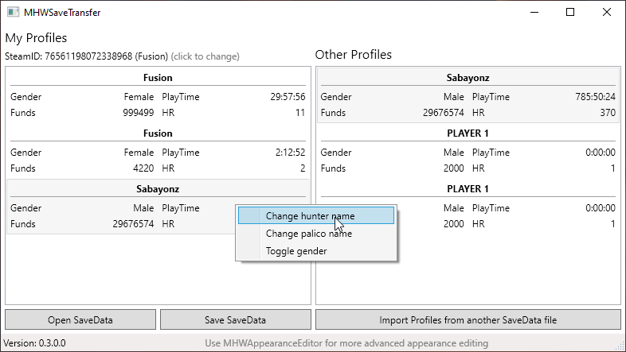
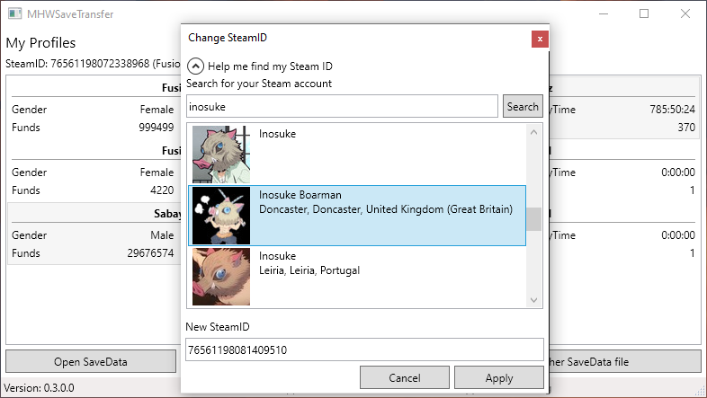

# MHWSaveTransfer

Import saveslots/profiles from a different savedata/savefile into your savedata.

Uses [Cirilla.Core](https://github.com/Fusion86/Cirilla/tree/master/Cirilla.Core)

## Screenshots

