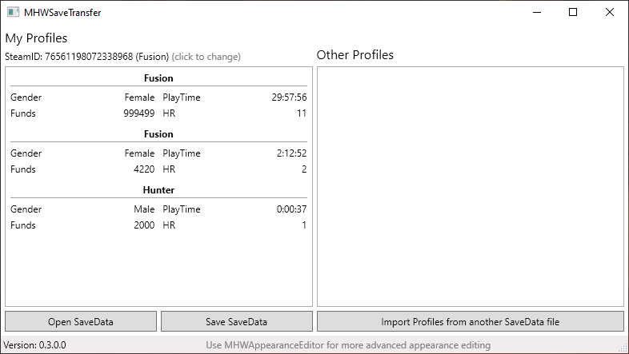
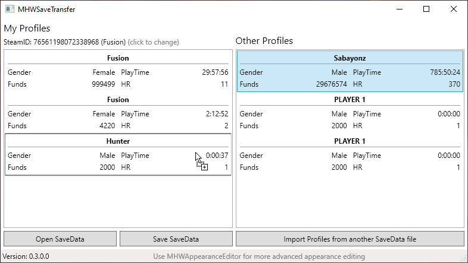

# MHWSaveTransfer

Import saveslots from a different savedata into your savedata.  
E.g import a saveslot downloaded from NexusMods and place it in saveslot 2 for your account.

Needs [Cirilla.Core](https://github.com/Fusion86/Cirilla/tree/master/Cirilla.Core)

## Screenshots

